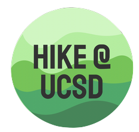

## Rules and Regulations
TBD

## Sign Up Instructions
For the given quarter, there will be a table of hikes for each week. The table includes information about the hike
so that you can decide whether it's a good fit for you. 
- The first column lists the `Week` during which the hike will take place
  - For example: `Week 2` typically means that the hike will occur on the weekend of `Week 2`
- The `Difficulty` column indicates how punishing the hike is. This is usually based off of elevation gain.
  - For example: a `hard` hike might have 2500ft of elevation gain while an `easy` hike has 50
- The `Location` and `Trailhead` columns include links to either a Google Maps location or site about said trail
- The `Distance` column is only an approximation of how many miles the trail is
- The `Drive Time` column indicates how long it will take to drive to the trailhead from campus
  - Please us this to narrow down whether you can commit to a far drive as it oftens takes up the day
 
### Non-Drivers
For those who would like to join hikes as passengers, all you need to do is sign up in the table below. We ask that you
pay **$5** to your driver to offset gas costs at this time. We typically have an officer in every car to make sure
all passengers feel safe and secure, especially with an unfamiliar driver. If you have any concerns or feel uncomfortable
with your assigned driver or fellow passengers, let us know asap and we'll try our best to help.

### Drivers
If you have a car and would be willing to drive fellow students to the trailhead, please let one of the officers know.
Drivers are reimbursed for gas whenever possible. Often, the passengers will each Venmo **$5** to the driver. (For far hikes,
we may increase the asked amount to account for the difference in gas expenditure). We are always looking for drivers
so please reach out.

## Hikes
List of all the hikes the club has done. Note that all hikes from **Spring 2020** to **Spring 2021** were NOT hosted by the 
club but given as suggestions because of the current Covid-19 epidemic. For those using these hikes as suggestions, 
please be mindful of Covid restrictions for that county, maintain your distance (6ft apart), wear a mask, and stay safe.
Also be aware that hiking in California from May - October has recently been impacted by wildfires and bad air quality so
always check the conditions before heading out. We hope that Fall 2021 will allow the club to resume hosting hikes.

### Fall Quarter 2020
| When       | Difficulty | Location                                                                                                  | Distance  | Drive Time | Description |
| ---------- | ---------- | --------------------------------------------------------------------------------------------------------- | --------- | ---------- | ----------- |
| Week 0     | `Hard`     | [Potato Chip Rock](https://hikingguy.com/hiking-trails/hiking-san-diego/potato-chip-rock-hike-san-diego/) | `7.5 mi`  | `30 min`   | LINK |
| Week 1     | `Moderate` | [Corte Madera](http://www.ihikesandiego.com/corte-madera-mountain/)                                       | `9.8 mi`  | `75 min`   | LINK |
| Week 2     | `Moderate` | [Iron Mountain Peak](https://www.ihikesandiego.com/iron-mountain-hike/)                                   | `5.8 mi`  | `30 min`   | LINK |
| Week 3     | `Easy`     | [Los Peñasquitos Canyon](https://www.alltrails.com/trail/us/california/los-penasquitos-canyon-trail)      | `7.3 mi`  | `30 min`   | LINK |
| Week 4     | `Moderate` | [Cuyamaca Peak Loop](https://www.alltrails.com/trail/us/california/cuyamaca-peak-via-azalea-glen-loop)    | `7.7 mi`  | `60 min`   | LINK |
| Week 5     | `Easy`     | [Fletcher Point](https://www.alltrails.com/trail/us/california/fletcher-point)                            | `5.8 mi`  | `20 min`   | LINK |
| Week 6     | `Moderate` | [Cowles Mountain](https://hikingguy.com/hiking-trails/hiking-san-diego/cowles-mountain-hike/)             | `5.0 mi`  | `20 min`   | LINK |
| Week 7     | `Easy`     | [Ho Chi Minh](https://hiddensandiego.net/things-to-do/places/ho-chi-minh-trail)                           | `1 mi`    | `5 min`    | LINK |
| Week 8     | `Moderate` | [Castle Rock](https://www.alltrails.com/trail/us/california/castle-rock-trail), [Butler Peak](https://www.alltrails.com/trail/us/california/butler-peak-trail), [Skyline](https://www.alltrails.com/trail/us/california/skyline-divide-trail)      | ---       | `3 hours`  | LINK |
| Week 9     | `Easy`     | [Carmel Mountain](https://www.alltrails.com/trail/us/california/carmel-mountain-preserve-loop)            | `2.7 mi`  | `10 min`   | LINK |
| Week 10    | `Hard`     | ["El Cap" El Cajon Mountain](http://hikingsdcounty.com/el-cajon-mountain-el-cap/)                         | `11.3 mi` | `30 min`   | LINK |

### Spring Quarter 2020
*No hikes due to Covid-19*

### Fall Quarter 2019
| When       | Date         | Meet Time    | Meet Location         | Location                          | Distance  | # Slots | Description |
| ---------- | ------------ | ------------ | --------------------- | --------------------------------- | --------- | ---------- | ----------- |
| Week 0     | `9/28/2019`  | `12 pm`      | Muir Volleyball Court | N/A **(Club Social)**             | ---       | ---        | LINK        |
| Week 1     | `10/5/2019`  | `9 am`       | Revelle Parking Lot   | [Cuyamaca](https://hikingguy.com/hiking-trails/hiking-san-diego/hiking-stonewall-peak-trail/) | `5mi`   | `19` | LINK        |
| Week 2     | `10/12/2019` | `8 am`       | Revelle P103          | [Fletcher Point](https://www.alltrails.com/trail/us/california/fletcher-point) | `5.8 mi` | `13` | LINK        |
| Week 3     | `10/19/2019` | `8 am`       | Revelle P103          | [Palomar Mountain](https://modernhiker.com/hike/hiking-palomar-mountain-state-park/) | `9 mi` | `8` | LINK        |
| Week 4     | `10/27/2019` | `8 am`       | Revelle P103          | Mission Trails | `3 mi` | `8` | LINK        |
| Week 5     | `11/3/2019`  | `8 am`       | Revelle P103          | Torrey Pines   | `3 mi` | `8` | LINK        |
| Week 6     | **Holiday Weekend** | | | | | |
| Week 7     | `11/17/2019` | `8 am`       | Revelle P103          | [Iron Mountain Peak](https://www.hikingproject.com/trail/7022637/iron-mountain-peak-trail-10) | `6 mi` | `5` | LINK        |
| Week 8     | `11/23/2019` | `8 am`       | Revelle P103          | [McGinty](https://www.alltrails.com/trail/us/california/mcginty-mountain-trail) | `5 mi` | `8` | LINK        |
| Week 9     | **Holiday Weekend** | | | | | |

### Summer 2019
| When       | Date         | Meet Time    | Meet Location         | Location                          | Distance  | # Slots | Description |
| ---------- | ------------ | ------------ | --------------------- | --------------------------------- | --------- | ---------- | ----------- |
| ---        | `8/4/2019`   | `7 am`       | Peterson Loop         | [Three Sisters Falls](https://www.alltrails.com/trail/us/california/three-sisters-waterfalls-trail) | `4 mi`   | `7`     | LINK        |

### Spring 2019
| When       | Date         | Meet Time    | Meet Location         | Location                          | Distance  | # Slots | Description |
| ---------- | ------------ | ------------ | --------------------- | --------------------------------- | --------- | ---------- | ----------- |
| Spring Break | `3/31/2019` | `10 am`     | Mandeville Loop       | [Peñasquitos](https://www.alltrails.com/trail/us/california/los-penasquitos-canyon-trail) | `7 mi`   | `8`     | LINK        |
| Week 2     | `4/13/2019`  | `8 am`       | Mandeville Loop       | [Anza Borrego](http://www.parks.ca.gov/?page_id=638) | `6 mi`   | `16`     | LINK        |
